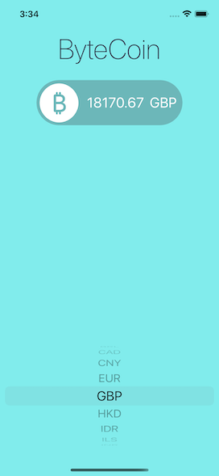

#  ByteCoin

## What I have learned

* Learn to use URLSession to network and make HTTP requests.
* Parse JSON with the native Encodable and Decodable protocols. 
* Learn to use Grand Central Dispatch to fetch the main thread.
* Learn to use UIpicker when we have limited choice of options. 

